    

    <b>Automatic Architecture Diagrams from Code</b> 
    <a href="https://github.com/swark-io/swark">GitHub</a> • <a href="https://swark.io">Website</a> • <a href="mailto:contact@swark.io">Contact Us</a>

## Usage Instructions

1. **Render the Diagram**: Use the links below to open it in Mermaid Live Editor, or install the [Mermaid Support](https://marketplace.visualstudio.com/items?itemName=bierner.markdown-mermaid) extension.
2. **Recommended Model**: If available for you, use `claude-3.5-sonnet` [language model](vscode://settings/swark.languageModel). It can process more files and generates better diagrams.
3. **Iterate for Best Results**: Language models are non-deterministic. Generate the diagram multiple times and choose the best result.

## Generated Content
**Model**: GPT-4o - [Change Model](vscode://settings/swark.languageModel)  
**Mermaid Live Editor**: [View](https://mermaid.live/view#pako:eNqVlktT2zAQgP8K4zONhuktN5PwCIU-gJa2mPHI0toWsSVVjxTD8N8rJ6UNlSyne_BI8n6769VK3qeECArJNMl4pbCs967nGd9zom2xWcgSzPIacGPqvGSGg9Y5roCbLNlo9pLe_tZYv5nI7u7vuy1LK-CrbayXw1tdYwXo3srOgEK8gAcDXDPBNZIdBbJEf1Yu4YdlCvTkXt-9NjO7PWcF0szAG4nJ0sWh0U9sSE1FhVagevp1XL3MA5RVTcOKt4gIzoGYIHcU85bnjDOT5z52HMPWgxao8LmTAJd3uG0ivk5DvqDQgizBaFQq3Lo8etgijmkJQK3UE_IPdzbCgXKb4Lt7F8ekEkYQ0fjgeRxkrRTKBL7vIs7VxsiDAx97H8esYj7zIc5slXmBNfj8xzhvOsl45WOf4lgDFSYdwtbUPns5sosdJ4g0zDvjvVwFWPNIscHoUXBgvBRoVrMGIkV7HbCxrnNqWxmqn89DAOmfvv6XQX23D0ZZYkTAy80w5epMhwL7ukM2FpwyzCPp-LaDkQt4YEREjHzfwcgwnabBK9JNW9lgE9vM9HAEXWHFcNEESj-djaAvgwA6H0GFoqCAagjUcHo0AmMZOOjp8Q4pTkvFCI6l62QXKy2szaSq_9EyHjV4OlS2Rizd1RMgFkMEd11CCDj7j5g35T4UMXC6mawHyX7iqBYz6nqTpywxNbSQJVPXRFAosW1c-_HslKx0vmDOsGsx2mTqTjDsJ-5uE1fuqnqZK2GrOpmWuNHw_AsOTu4P) | [Edit](https://mermaid.live/edit#pako:eNqVlktT2zAQgP8K4zONhuktN5PwCIU-gJa2mPHI0toWsSVVjxTD8N8rJ6UNlSyne_BI8n6769VK3qeECArJNMl4pbCs967nGd9zom2xWcgSzPIacGPqvGSGg9Y5roCbLNlo9pLe_tZYv5nI7u7vuy1LK-CrbayXw1tdYwXo3srOgEK8gAcDXDPBNZIdBbJEf1Yu4YdlCvTkXt-9NjO7PWcF0szAG4nJ0sWh0U9sSE1FhVagevp1XL3MA5RVTcOKt4gIzoGYIHcU85bnjDOT5z52HMPWgxao8LmTAJd3uG0ivk5DvqDQgizBaFQq3Lo8etgijmkJQK3UE_IPdzbCgXKb4Lt7F8ekEkYQ0fjgeRxkrRTKBL7vIs7VxsiDAx97H8esYj7zIc5slXmBNfj8xzhvOsl45WOf4lgDFSYdwtbUPns5sosdJ4g0zDvjvVwFWPNIscHoUXBgvBRoVrMGIkV7HbCxrnNqWxmqn89DAOmfvv6XQX23D0ZZYkTAy80w5epMhwL7ukM2FpwyzCPp-LaDkQt4YEREjHzfwcgwnabBK9JNW9lgE9vM9HAEXWHFcNEESj-djaAvgwA6H0GFoqCAagjUcHo0AmMZOOjp8Q4pTkvFCI6l62QXKy2szaSq_9EyHjV4OlS2Rizd1RMgFkMEd11CCDj7j5g35T4UMXC6mawHyX7iqBYz6nqTpywxNbSQJVPXRFAosW1c-_HslKx0vmDOsGsx2mTqTjDsJ-5uE1fuqnqZK2GrOpmWuNHw_AsOTu4P)

```mermaid
graph TD
    subgraph "ai_health_fitness_agent"
        A[health_agent.py]
        subgraph "venv"
            B[share/jupyter/nbextensions/pydeck/extensionRequires.js]
            C[Lib/site-packages/watchdog/version.py]
            D[Lib/site-packages/urllib3/connection.py]
            E[Lib/site-packages/watchdog/__init__.py]
            F[Lib/site-packages/watchdog/watchmedo.py]
            G[Lib/site-packages/_yaml/__init__.py]
            H[Lib/site-packages/websockets/frames.py]
            I[Lib/site-packages/websockets/speedups.c]
            J[Lib/site-packages/websockets/server.py]
            K[Lib/site-packages/websockets/protocol.py]
            L[Lib/site-packages/websockets/imports.py]
            M[Lib/site-packages/websockets/http11.py]
            N[Lib/site-packages/websockets/uri.py]
            O[Lib/site-packages/websockets/extensions/base.py]
            P[Lib/site-packages/websockets/typing.py]
            Q[Lib/site-packages/websockets/legacy/auth.py]
            R[Lib/site-packages/websockets/sync/client.py]
            S[Lib/site-packages/tzdata/zoneinfo/Chile/__init__.py]
            T[Lib/site-packages/yaml/dumper.py]
            U[Lib/site-packages/yaml/cyaml.py]
            V[Lib/site-packages/yaml/constructor.py]
            W[Lib/site-packages/yaml/composer.py]
            X[Lib/site-packages/tzdata/zoneinfo/Indian/__init__.py]
            Y[Lib/site-packages/tzdata/zoneinfo/Mexico/__init__.py]
            Z[Lib/site-packages/tzdata/zoneinfo/__init__.py]
            AA[Lib/site-packages/uritemplate/__init__.py]
            AB[Lib/site-packages/uritemplate/variable.py]
            AC[Lib/site-packages/uritemplate/template.py]
            AD[Lib/site-packages/uritemplate/orderedset.py]
            AE[Lib/site-packages/uritemplate/api.py]
            AF[Lib/site-packages/tzdata/zoneinfo/Africa/__init__.py]
            AG[Lib/site-packages/tzdata/zoneinfo/America/Argentina/__init__.py]
            AH[Lib/site-packages/yaml/tokens.py]
            AI[Lib/site-packages/yaml/nodes.py]
            AJ[Lib/site-packages/tzdata/zoneinfo/America/Indiana/__init__.py]
        end
    end
```

